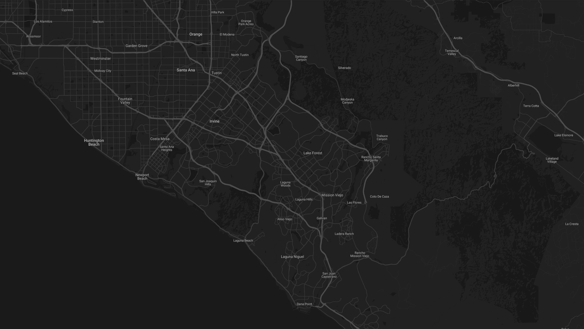

A neutral, clean, and professional theme for Google Maps created by <a href="https://www.kapax.pro">Kapax</a>.

## Installation
Follow the [Google Maps documentation](https://developers.google.com/maps/documentation) to learn how to build with Google Maps. Then use the styles portion of the included code or modify to your liking.
